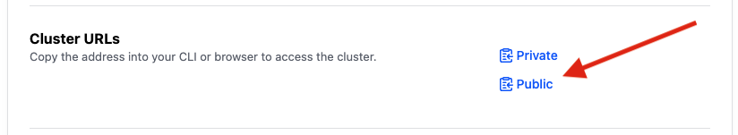
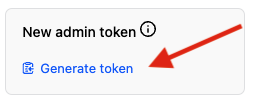

Certainly! Here are some additional clarifications and enhancements:

## Introduction
This guide aims to provide a clear walkthrough for accessing secrets stored in HashiCorp Vault hosted on HCP (HashiCorp Cloud Platform) using Terraform. We'll establish an AppRole authentication method and create a simple Key-Value (KV) store within Vault. Then, we'll demonstrate how to retrieve a secret from this store using Terraform.

## Setup Vault
Let's begin by configuring Vault. We'll utilize HCP Vault for this guide. If you haven't set up HCP Vault yet, refer to the provided guide for initial setup instructions.

### Setting Vault Environment
Ensure that you have the Vault address and token handy. Set them as environment variables for easy access throughout the setup process.

You can get this via the HCP UI if needed:

> **_NOTE:_** It's recommended to avoid using the root token, especially in production environments. If you have a different method for accessing HCP Vault, such as another authentication method, it's advisable to use that instead of the root token. The root token should only be used for testing purposes.





```bash
export VAULT_ADDR='https://**********:8200'
export VAULT_TOKEN="hvs.**********"
```

### Configure Namespace
Namespaces are useful for organizing and managing Vault resources. If you're using HCP Vault, specify the namespace accordingly.

```bash
export VAULT_NAMESPACE=admin
vault namespace create dev
export VAULT_NAMESPACE=admin/dev
```

### Create KV Store
We'll create a KV version 2 secrets engine within the `dev` namespace and add a simple secret to it.

```bash
vault secrets enable -namespace=admin/dev -version=2 kv
vault kv put -namespace=admin/dev -mount=kv my-secret foo=a bar=b
```

### Define Policy
To control access to secrets, we'll define a policy that allows access to secrets within the KV store.

```bash
vault policy write -namespace=admin/dev tf-kv tf-kv.hcl
```

### Setup AppRole
AppRole authentication provides a secure way to authenticate applications and services with Vault. We'll configure an AppRole with the appropriate permissions.

```bash
vault auth enable -namespace=admin/dev approle

vault write -namespace=admin/dev auth/approle/role/my-role \
    secret_id_ttl=0 \
    token_ttl=20m \
    token_max_ttl=30m \
    token_policies=default,tf-kv

vault read -namespace=admin/dev auth/approle/role/my-role
```

### Retrieve AppRole Credentials
Retrieve the `role_id` and generate a `secret_id` for the AppRole. We'll need these credentials later for authentication.

```bash
vault read -namespace=admin/dev auth/approle/role/my-role/role-id
vault write -namespace=admin/dev -f auth/approle/role/my-role/secret-id
```

### Test AppRole Authentication
Verify that AppRole authentication works as expected by logging in and obtaining a token.

```bash
unset VAULT_TOKEN
unset VAULT_NAMESPACE
vault write -namespace=admin/dev auth/approle/login \
    role_id=******** \
    secret_id=******
```

The output will include a token. Save this token for subsequent steps.

## Accessing Secrets with Terraform
Now that we have obtained a token, let's utilize Terraform to retrieve the secret from the KV store.

```bash
export VAULT_TOKEN="hvb.AAAAAQJ8MIwEELB3ucD61Wi8TILD******"
vault kv get -namespace=admin/dev -mount=kv my-secret
```

## Running Terraform
Now we can test this via terraform, first copy `terraform.tfvars.example` to `terraform.tfvars`

```bash
cp terraform.tfvars.example terraform.tfvars
```

now update `terraform.tfvars` to include your `role_id`, `secret_id` and `vault_url` from before. After this run terraform
```bash
terraform init
terraform apply
```

the output will be masked as its a sensitvie value, you can use the follwoing if you wish to double check it exists
```bash
terraform show -json
```